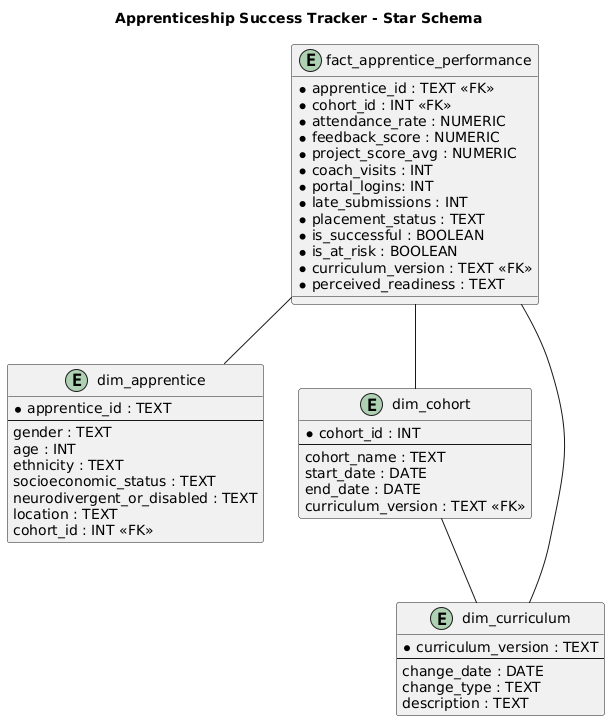

<h1 align="center">Apprentice Success Tracker</h1>

<a href="#project-description">Project Description</a> - <a href="#project-goal">Project Goal</a> - <a href="#technology-stack">Tech Stack</a>

## Project Description

A behaviourally-informed, stakeholder-driven analytics project simulating real-world apprentice outcomes across curriculum versions, equity dimensions, and success metrics. Built using SQL, dbt-style modular modeling, and reproducible mock data generation.

---

## Project Goal

Enable program managers to:
- Track apprentice success and risk
- Identify placement predictors
- Audit curriculum impact on outcomes
- Surface equity concerns (e.g., ND, SES, ethnicity)
- Prioritize data-driven interventions

---

## Stakeholder Context

**Role:** Program Manager overseeing apprentice outcomes  
**Key Questions:**
1. Which apprentices are most at risk of not being placed?
2. What traits and behaviours predict successful placements?
3. Why has apprentice churn increased since the most recent curriculum change?
4. How are apprentices engaging with training?
5. How do employers perceive apprentice readiness?

---

## Star Schema Design

- `dim_apprentice`: demographic + cohort-linked info
- `dim_cohort`: links curriculum version to training windows
- `dim_curriculum`: version history for learning format changes
- `fact_apprentice_performance`: performance metrics, flags, and audit-ready fields

---

## Mock Data Generation

Script: [`generate_mock_data.sql`](generate_mock_data.sql)

- 60 apprentices across 3 curriculum versions
- Stakeholder-driven random bias: e.g., ND + underserved = lower feedback
- Reproducible with `setseed(0.42)` for consistent demos
- Scores, feedback, engagement, risk, and placement status

---

## Views (for BI & audit)

| View Name | Purpose |
|-----------|---------|
| `vw_churn_by_curriculum` | Tracks placement success & churn across versions |
| `vw_success_predictors` | Generates weighted success score based on readiness, attendance, and punctuality |
| `vw_gender_bias_audit` | Equity audit by gender |
| `vw_ethnicity_bias_audit` | Equity audit by ethnicity |
| `vw_nd_bias_by_curriculum` | Intersectional analysis: curriculum + ND impact |
| `vw_outcomes_by_trait` | Pivoted summary by any key trait (ND, gender, SES) |

---

## Models (dbt-style layers)

| File Name | Purpose |
|-----------|---------|
| `stg_apprentice_data.sql` | Cleans and preps base apprentice info |
| `int_apprentice_metrics.sql` | Joins dimensions with performance facts |
| `final_success_risk_model.sql` | Calculates success score and predictor ranking |

---

## How to Run

1. **Load schema**: Run `generate_mock_data.sql` in PostgreSQL
2. **View insights**: Run audit queries or connect to BI tool (PowerBI/Metabase/Tableau)
3. **Optional**: Use views in dashboard filters (ND, gender, curriculum version)

---

## Sample Insight (from `vw_nd_bias_by_curriculum`)

> “Neurodivergent apprentices performed best under assessment-heavy (V1) formats. In unstructured formats (V3), risk rates spiked — suggesting structural rather than ability-related barriers. ND project scores remained solid even when perceived readiness dropped.”

---

## Author

**Ray** – Behavioural systems thinker, aspiring Data Analytics Engineer & Data Strategist.

---

## Next Steps

- Add dashboard layer (Power BI)

## Tech Stack

PostgreSQL – Used for mock data generation, modelling, and querying

dbt-Inspired Folder Structure – Models split into staging, intermediate, and final layers

GitHub – Version-controlled and structured for extensibility

Power BI – Dashboard layer for stakeholder delivery

Behavioural Science + Equity Lens – Used to frame risk logic and stakeholder relevance

